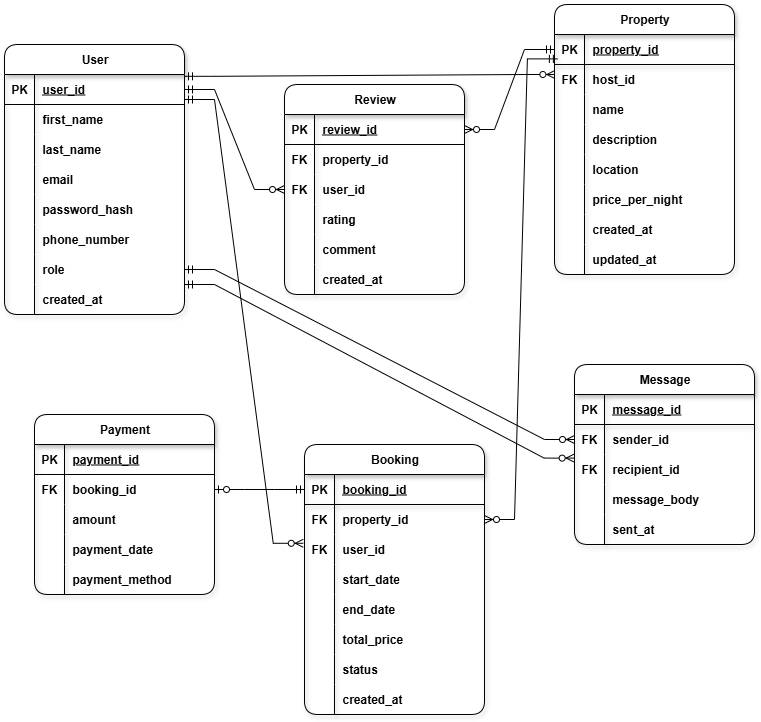

# Airbnb Database ERD Requirements

## ERD Diagram
Below is the Entity-Relationship Diagram (ERD) for the Airbnb database.  
It visually represents all entities, their attributes, and the relationships between them.

---

## Entities and Attributes

### User
- user_id (PK, UUID, Indexed)
- first_name (VARCHAR, NOT NULL)
- last_name (VARCHAR, NOT NULL)
- email (VARCHAR, UNIQUE, NOT NULL)
- password_hash (VARCHAR, NOT NULL)
- phone_number (VARCHAR, NULL)
- role (ENUM: guest, host, admin, NOT NULL)
- created_at (TIMESTAMP, DEFAULT CURRENT_TIMESTAMP)

### Property
- property_id (PK, UUID, Indexed)
- host_id (FK → User.user_id)
- name (VARCHAR, NOT NULL)
- description (TEXT, NOT NULL)
- location (VARCHAR, NOT NULL)
- pricepernight (DECIMAL, NOT NULL)
- created_at (TIMESTAMP, DEFAULT CURRENT_TIMESTAMP)
- updated_at (TIMESTAMP, ON UPDATE CURRENT_TIMESTAMP)

### Booking
- booking_id (PK, UUID, Indexed)
- property_id (FK → Property.property_id)
- user_id (FK → User.user_id)
- start_date (DATE, NOT NULL)
- end_date (DATE, NOT NULL)
- total_price (DECIMAL, NOT NULL)
- status (ENUM: pending, confirmed, canceled, NOT NULL)
- created_at (TIMESTAMP, DEFAULT CURRENT_TIMESTAMP)

### Payment
- payment_id (PK, UUID, Indexed)
- booking_id (FK → Booking.booking_id)
- amount (DECIMAL, NOT NULL)
- payment_date (TIMESTAMP, DEFAULT CURRENT_TIMESTAMP)
- payment_method (ENUM: credit_card, paypal, stripe, NOT NULL)

### Review
- review_id (PK, UUID, Indexed)
- property_id (FK → Property.property_id)
- user_id (FK → User.user_id)
- rating (INTEGER, CHECK 1-5, NOT NULL)
- comment (TEXT, NOT NULL)
- created_at (TIMESTAMP, DEFAULT CURRENT_TIMESTAMP)

### Message
- message_id (PK, UUID, Indexed)
- sender_id (FK → User.user_id)
- recipient_id (FK → User.user_id)
- message_body (TEXT, NOT NULL)
- sent_at (TIMESTAMP, DEFAULT CURRENT_TIMESTAMP)

---

## Relationships (with cardinality and optionality)

- **User → Property**: One User can have 0 or many Properties  
  `USER ||------o< PROPERTY`  

- **User → Booking**: One User can have 0 or many Bookings  
  `USER ||------o< BOOKING`  

- **Property → Booking**: One Property can have 0 or many Bookings  
  `PROPERTY ||------o< BOOKING`  

- **Booking → Payment**: One Booking may have 0 or 1 Payment  
  `BOOKING ||------o| PAYMENT`  

- **Property → Review**: One Property can have 0 or many Reviews  
  `PROPERTY ||------o< REVIEW`  

- **User → Review**: One User can write 0 or many Reviews  
  `USER ||------o< REVIEW`  

- **User → Message (sender_id)**: One User can send 0 or many Messages  
  `USER ||------o< MESSAGE (sender_id)`  

- **User → Message (recipient_id)**: One User can receive 0 or many Messages  
  `USER ||------o< MESSAGE (recipient_id)`  
